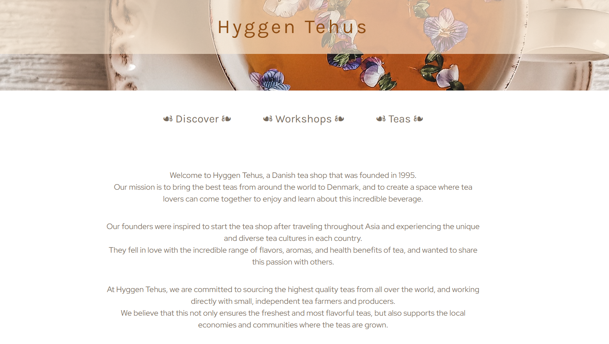
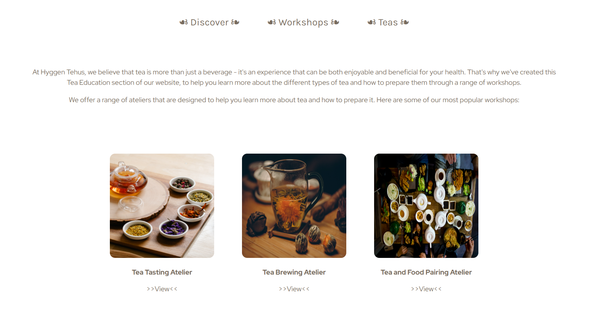
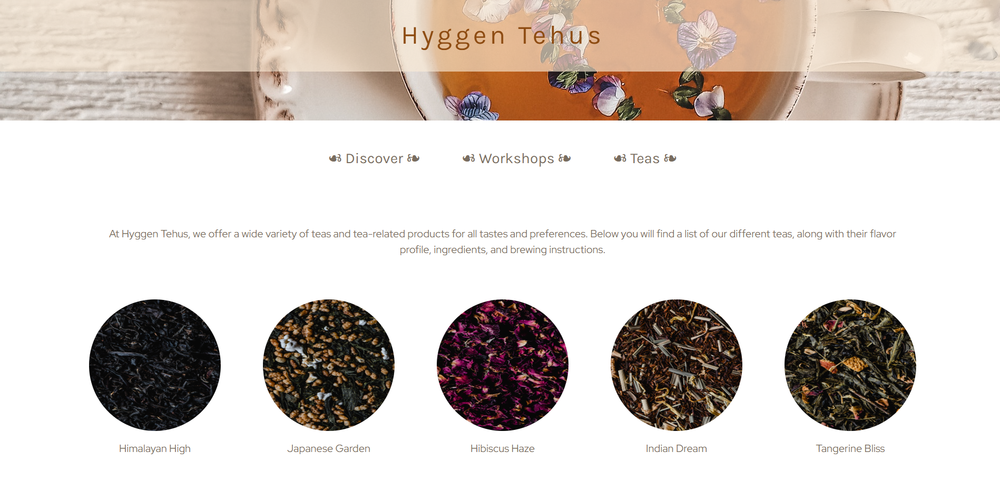

# Hyggen-Tehus

This dynamic website project was made using Express, EJS and vanilla CSS.

The design revolves around the concept of hygge (Hyggen Tehus meaning "cozy teahouse") wich is a popular concept in Danish Culture. Associated with hygge, tea makes the perfect subject of such a project.

### Desktop View

- Landing page

- Workshops page

- Teas page

